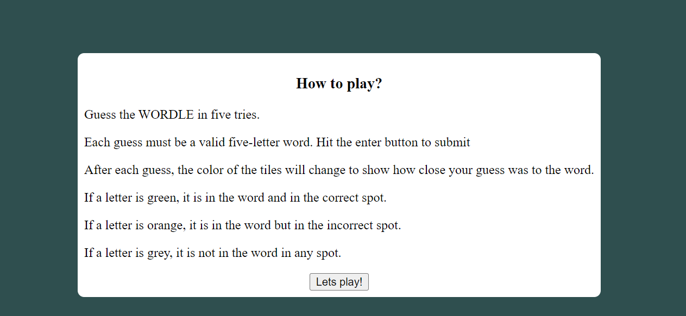
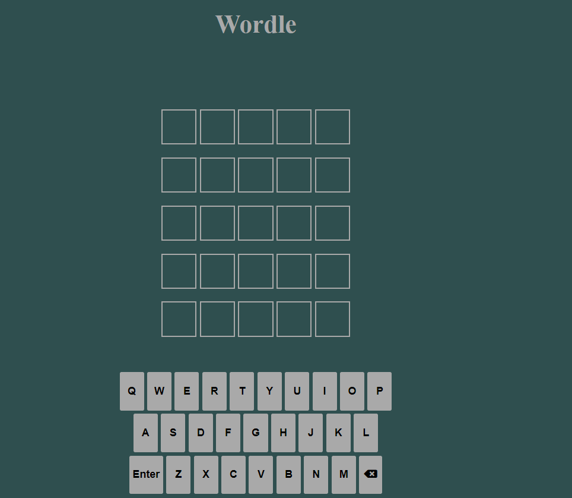
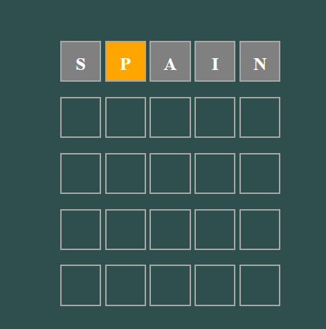
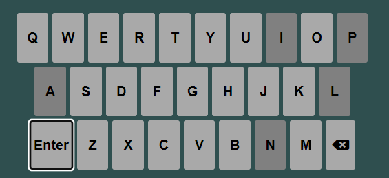
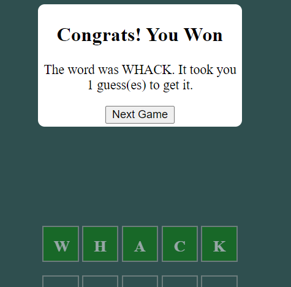
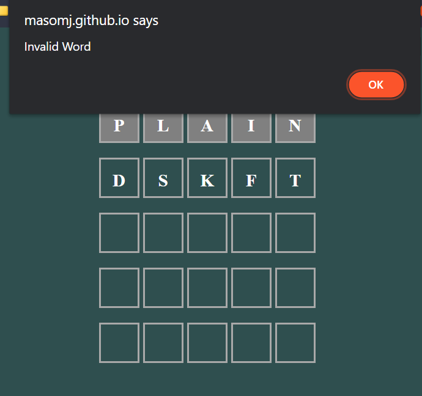

# Project-Milestone-2-Wordle
Project Milestone 2 -  A browser based word guessing game

This game is a browser based word game. The concept comes from the game named "Wordle", now owned by the New York Times. I Created this game in native HTML5, CSS3 and Javascript. The aim of the game is to guess the five letter word, in five guesses. After each guess the user is informed, by a colour change, whether the letters they entered are contained in the word, and whether they are in the correct index. 

The goal of this project was to display my skills in HTML, CSS and mainly Javascript by creating a complex game that is both visually appealing, fun to play and responsive across all browsers and display sizes. 

# UX (User Experience) 
## User Stories 
  - As a new user, I want to be able to be instructed on how to play a word based game.
  - As a new user, I want to be able to play a word based game.
  - As a new user, I want to be able to enjoy playing the game without distractions like adverstisements.
  - As a returning user, I want to be able to play this game more than once per day.
  - As a returning user, I want to be able to track my previous progress in the game. 
## User Journey
  The user journey through the site is the same for all visitors. The landing page and main game is all on the same page. At the landing page, a popup displaying the games intructions teaches the user the requirements for winning and how to do so. Once they have begun playing the game, they are given visual feedback in the form of the colour changes to indicate whether they are progressing towards the correct word or not. In addition, the main game page is a simple yet effective screen, with little in the form of distracting elements. The title is the only non funcitonal element on the screen. 
  
 ## Wireframes
 These wireframes gave me a rough idea of what I wanted the UI to look like before I began development. This allowed me to stay focused on the game functionality, rather than tweaking the UI.

 # Technologies and Tools
 - HTML5
 - CSS3
    - I decide to use HTML and CSS to create the UI as they are they most widely used front end languages in Website development
 - JavaScript
    - I decided to write this project in Vanilla JavaScript as before I get to grips with any libraries and frameworks based on it, I need to be confident in plain           Javascript first.  
 - Git and Github
    - I used Git to enact Version Control when producing my project, whilst using Github as the remote repository storage tool due its widespread industary usage.  
 - VS Code
    - I decided to use VS Code instead of Gitpod as I prefer working on a full fledged desktop editor, that I can install extensions on and store source files on my          local machine.
    - I used Git via the command line in VS Code, though there is a GUI version available from GitHub, but as the industry standard is Command line it is important to       become proficient in Command line git.
- Balsamiq 
  - I used balsamiq to create the wireframes and desgin for the website.     
- Font Awesome
  - I imported a toolkit from fontawsome in order to get the backspace icon on the onscreen keyboard 
 # Features
 ## The instuctions page
 The instructions page is the first thing any user sees when they access the website. Simple and brief instructions are shown to the user, though in keeping with the theme for this site, they are minimalist in nature. 
 
 ## The game page
 This is the main page of the game. This holds all the HTML structure required for the user's and subsequent javascript functions to interact with. It is simple in desigh, comprising of 1 heading and 2 main game areas. The Guess Display area and the onscreen keyboard. Upon winning or losing, a popup appears, locking out the rest of the game, asking the user to play again. 
 
 ### Guess Area
 If a letter is in the correct place in the word, it will turn green. If it is in the word, but not in correct place, the letter will turn orange. If it is not in the word at all, it will remain become black. 
 
 ### The onscreen keyboard
 The decision to include an onscreen keyboard was made so that we can display whether a letter has already been used on the keyboard as well, which provides another visual indicator of the user's progress.
 
 ## The end game
 This pop up is created as empty HTML Elements and is hidden by default on page load. Then, the text is changed based on whether the user has won or lost.
 
 ## Invalid word
 The decision was made to use a browser alert to infrom the user if they enter an invalid word, as it requires the user's interaction before the game can continue, which can help avoid confusion around wether the word is valid. 
 
# Testing
In order to ensure that I reach the largest audience, I had to ensure my game worked across multiple browser and screen types. In this section, I detail the manual testing I performed to ensure that this criteria was met. Some of the manual testing was performed by members of my family. This teting was very useful as it pointed out several shortfalls and issues with the game.

## Manual User Testing
 - the first issue observed in the manual testing was that on smaller size displays, the keyboard was too small to use. To resolve this, I created a CSS media query and changed the size of the keyboard to be 320px wide in total.
 - the next issue was that when you failed to guess the word, the popup would not display 
## Cross Browser testing
## Compatability Teting
## Responsiveness Testing

