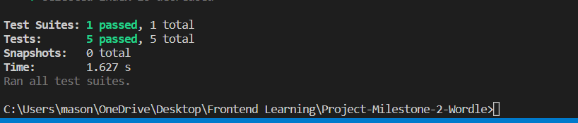
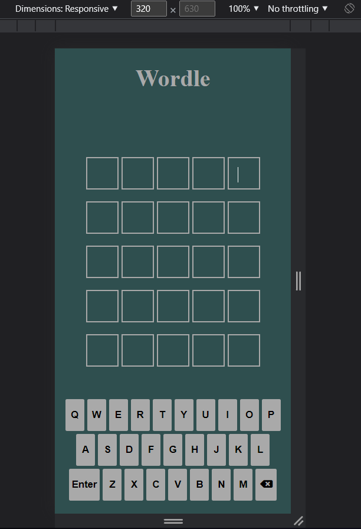
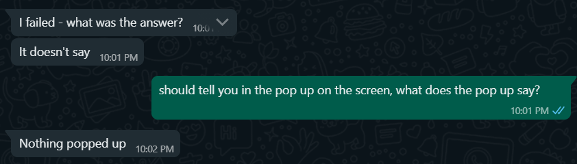

# Project-Milestone-2-Wordle
Project Milestone 2 -  A browser based word guessing game

This game is a browser based word game. The concept comes from the game named "Wordle", now owned by the New York Times. I Created this game in native HTML5, CSS3 and Javascript. The aim of the game is to guess the five letter word, in five guesses. After each guess the user is informed, by a colour change, whether the letters they entered are contained in the word, and whether they are in the correct index. 

The goal of this project was to display my skills in HTML, CSS and mainly Javascript by creating a complex game that is both visually appealing, fun to play and responsive across all browsers and display sizes. 

# UX (User Experience) 
## User Stories 
  - As a new user, I want to be able to be instructed on how to play a word based game.
  - As a new user, I want to be able to play a word based game.
  - As a new user, I want to be able to enjoy playing the game without distractions like advertisements.
  - As a returning user, I want to be able to play this game more than once per day.

## User Journey
  The user journey through the site is the same for all visitors. The landing page and main game is all on the same page. At the landing page, a popup displaying the games instructions teaches the user the requirements for winning and how to do so. Once they have begun playing the game, they are given visual feedback in the form of the colour changes to indicate whether they are progressing towards the correct word or not. In addition, the main game page is a simple yet effective screen, with little in the form of distracting elements. The title is the only non functional element on the screen. 
  
 ## Wireframes
 These wireframes gave me a rough idea of what I wanted the UI to look like before I began development. This allowed me to stay focused on the game functionality, rather than tweaking the UI.
[Main Game Page wireframe](docs/mainWireframe.png)
[Mobile game page wireframe](docs/mobileWireframe.png)
 ### Design Rationale
 #### Guess Area
The decision to include 5 guesses was taking to keep 5 as a continuity number, as it is a game about guessing a five letter word. Having separate guess areas for each allows for the user to easier receive the feedback on their interaction with the game, as each one visually changes colour after the user has submitted the guess. 

#### On Screen Keyboard
Having an on screen keyboard was a design and game functionality decision. This was done to ensure that the user can receive additional visual feedback than from the guess area, by having the on screen keyboard, I ensured that each key will change colour when used in the guess, in correspondence with the guess area. In addition, without the on screen keyboard, the game screen would look empty, with just 5 rows of 5 squares. 

#### Colour Scheme

The colours of Green, Orange and Grey were used for correct, present and not present respectively as they are intuitive colours which indicate a status of something. The colours are giving further clarification in the instruction manual at the beginning of the game however, in case not all users find the colour intuitive. 

Initially, I wanted to use yellow for the present category, however, this didn't provide a good enough contrast with the text contained in the box making it hard to read. Therefore, I changed the colour too orange. 

I wanted the game to have a casual feel to it, which is why I chose a background colour of Dark Slate Gray. This a dark shade that isn't too bright. It also provides a good contrast against all the dom elements in the game. 

 # Technologies and Tools
 - HTML5
 - CSS3
    - I decide to use HTML and CSS to create the UI as they are they most widely used front end languages in Website development
 - JavaScript
    - I decided to write this project in Vanilla JavaScript as before I get to grips with any libraries and frameworks based on it, I need to be confident in plain           Javascript first.  
 - Git and Github
    - I used Git to enact Version Control when producing my project, whilst using Github as the remote repository storage tool due its widespread industary usage.  
 - VS Code
    - I decided to use VS Code instead of Gitpod as I prefer working on a full fledged desktop editor, that I can install extensions on and store source files on my          local machine.
    - I used Git via the command line in VS Code, though there is a GUI version available from GitHub, but as the industry standard is Command line it is important to       become proficient in Command line git.
- Balsamiq 
  - I used balsamiq to create the wireframes and desgin for the website.     
- Font Awesome
  - I imported a toolkit from fontawsome in order to get the backspace icon on the onscreen keyboard 

 # Features
 ## The instuctions page
 The instructions page is the first thing any user sees when they access the website. Simple and brief instructions are shown to the user, though in keeping with the theme for this site, they are minimalist in nature. 
 
 ## The game page
 This is the main page of the game. This holds all the HTML structure required for the user's and subsequent javascript functions to interact with. It is simple in desigh, comprising of 1 heading and 2 main game areas. The Guess Display area and the onscreen keyboard. Upon winning or losing, a popup appears, locking out the rest of the game, asking the user to play again. 
 
 ### Guess Area
 If a letter is in the correct place in the word, it will turn green. If it is in the word, but not in correct place, the letter will turn orange. If it is not in the word at all, it will remain become black. 
 
 ### The onscreen keyboard
 The decision to include an onscreen keyboard was made so that we can display whether a letter has already been used on the keyboard as well, which provides another visual indicator of the user's progress.
 
 ## The end game
 This pop up is created as empty HTML Elements and is hidden by default on page load. Then, the text is changed based on whether the user has won or lost.
 
 
 ## Invalid word
 The decision was made to use a browser alert to infrom the user if they enter an invalid word, as it requires the user's interaction before the game can continue, which can help avoid confusion around wether the word is valid. 
 

 ## Future Features
 - In the future, I would like to implement a back end database the keeps track of users' statistics 
 - I would also like to implement a feature that only results in a user having to read the instructions once
 - I would like to create different difficulty levels, so have 7 letter words as a harder version of the game
# Testing
In order to ensure that I reach the largest audience, I had to ensure my game worked across multiple browser and screen types. In this section, I detail the manual testing I performed to ensure that this criteria was met. Some of the manual testing was performed by members of my family. This testing was very useful as it pointed out several shortfalls and issues with the game.
## User Story Testing
 > As a new user, I want to be able to be instructed on how to play a word based game.
 - This is achieved by implementing an instruction manual when a user visits the site.
> As a new user, I want to be able to play a word based game.
- This is achieved by implementing a word based guessing game. 
> As a new user, I want to be able to enjoy playing the game without distractions like advertisements.
- This is achieved by keeping the dom free of unnecessary  items
> As a returning user, I want to be able to play this game more than once per day. 
- This is achieved as the game is re-playable. At the end game, the user is prompted to play again,, with a different word choice. 

## Code Validation
### HTML
The W3 Schools Validator errored on duplicate Ids and some empty headings.

The boxes in each guess row are all labeled as Index1 through to Index 5. This doesn't affect the operation of the game, as they are all in separate div wrappers and are accessed according to their parent Id and individual Id. 

The headings are empty as they are filled by javascript code at the endgame.

The validator did however, point out that I had left an empty class attribute in my html code, which I promptly removed. 

[HTML Validator Screenshot](docs/HTMLvalidator.png)
### CSS
The W3 Schools css validator returned no errors. 
[CSS Validator Screenshot](docs/CSSvalid.png)

### Javscript
Running my JS code through the JS Hint validator identified several best practice shortfalls, such as missing semicolons. It also identifed 3 unused variables. These exist so that the code can be made testable via Jest, so I decided to leave them in the code to demonstrate testability. If this were a commerical project, I would remove unused variables from the finished deployment as they will use up unnecessary memory. 
[JS Hint Validator screenshot](docs/JshintvalidatorScreenshot.png)
## Jest Testing
To ensure that my javascript worked as intended, I developed several Jest tests. The requirement to include jest was only made towards the end of the project, so test driven development hasn't been demonstrated here. However, in future projects I would adopt a TDD approach. 

In total, I developed 5 tests. Each testing different elements. 

## Bugs
There are now longer any outstanding bugs in the game. However, I did encounter several during development and testing. Some of which are detailed in the testing section below. 
- I found an issue that stopped the guessed word being treated as an array. I need to iterate through the letters in the guessed word to check each letter against the index of the aim word. In order to resolve this, I created a separate array to store the input letters and performed the iteration on that instead. 
## Manual User Testing
 - The first issue observed in the manual testing was that on smaller size displays, the keyboard was too small to use. To resolve this, I created a CSS media query and changed the size of the keyboard to be 320px wide in total.
 
 - The next issue was that when you failed to guess the word, the popup would not display. This was resolved by changing the conditional statement to check for less than or equal to 5, instead of just less than. 
 
- Another issue that was verbally relayed to me was that the colour of the keyboard buttons didn't change alongside the letters in the guess area. This is a core piece of game functionality as it was the reasoning behind having an onscreen keyboard. In order to resolve this, I had to change how the array of letters created. it was declared inside a function, so only had local scope. I changed it so that the array of letters was populated and had global scope. 
## Cross Browser compatibility testing
Most modern browsers are built on chromium, so cross compatibility across chromium based browsers should be universal. To be thorough, the game was tested on 3 different chromium browsers. Brave, Microsoft Edge and Google Chrome. All game functionality was tested. As most modern computers will soon be running windows 11(which doesn't include Internet Explorer) and that Microsoft support for Internet Explorer is ending on the 15th June 2022, I decided not to include that browser in my testing. 

The testing criteria was:
   - Does the page load correctly?
   - Does clicking the start button set off the game?
   - Do the on screen keyboard elements work?
   - Does the color of the letters change when a guess is submitted, on both the keyboard and in the guess area?
   - Does the end game popup on the conditions of either win or lose?

All four of browsers I tested (firefox, Chrome, Edge and Brave) all passed the above testing criteria, below are screenshots of all the browsers passing the first test criteria.  
[Screenshot of game on firefox](docs/wordleFirefox.png)
[Screenshot of game on brave](docs/wordleBrave.png)
[Screenshot of game on edge](docs/wordleEdge.png)
[screenshot of game chrome](docs/wordleChrome.png)

## Deployment
### Local Deployment 
In order to deploy this project locally, you will require a text editor like Visual Studio Code. 
- There are 2 ways to deploy locally. You can download the code in .zip file directly from github or clone the repository on your machine following the steps in the next section. 

- Once the code is downloaded via either method, navigate to the directory in which it is saved, then right click the folder, and select "Open with VS Code". The whole project file will then open in VS code

- In order to make the development process easier, some VS code extensions I would recommend installing would be "Live Server". This create a live server in VS Code, which allows you to see changes made in real time. This is extremely useful for debugging. 
- In addition, Jest and node.js should be installed. 
[Node.js](https://nodejs.org/en/) can be found here. Just follow the onscreen prompts for installation.
- Once node is installed, install Jest. Jest's documentation can be found here [Jest](https://jestjs.io/). Though in order to install it, just run the following in the console.  
 > npm install --save-dev jest 
### Repository Cloning
Should you wish to work on this project, you will first needs to clone the repository. In order to do this, you can simply download the source files from github, or you can do this with GitBash. The steps below are for the GitBash process.
1. Navigate to the landing page of the repository you would like to clone.
2. Navigate to the Code section, and then copy the URL.
3. Open GitBash and type "Git Clone $Enter URL here$"

### Remote Deployment
This Website was deployed using github Pages.  To deploy a site to GitHub Pages, follow these steps.
1. Navigate to the repository you would like to publish.
2. Select "settings", then select the "Pages" sub menu.
3. Select the branch you wish to publish. (It will usually be "main") and hit save.
4. The site will go live in the next 10 minutes. Though it can take longer on some occasions.

## Credits
### Code
   -  As credited in the JS comments, I used a post from Stack Overflow to add a shake animation to my guess area when an invalid word is entered. 
   [Stack Overflow](https://stackoverflow.com/questions/25221243/how-can-i-make-my-javascript-wait-0-5-seconds-before-running-the-next-statement)

   - All other code was written by me.
### Media
No external media sources were used in this project.

### Acknowledgments
 - My mentor for initial guidance with JS structuring.
 - Tutor support for putting on a session to clarify the scope of the jest implementation required. 
